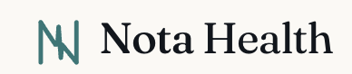
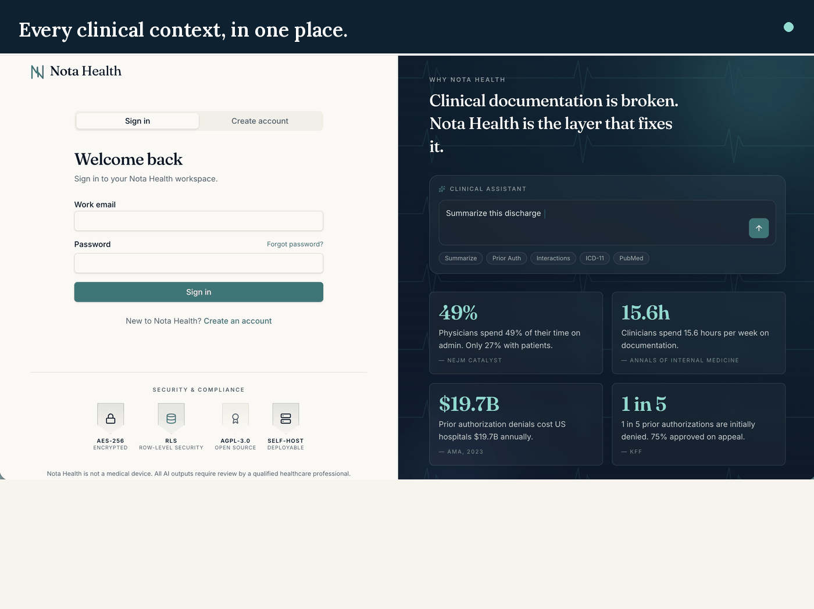
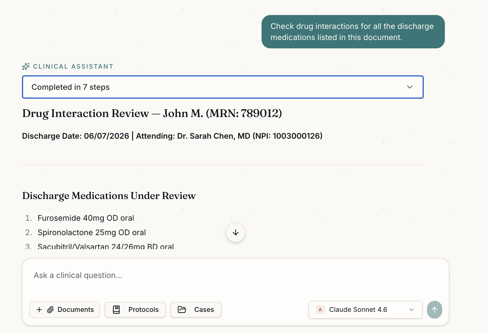
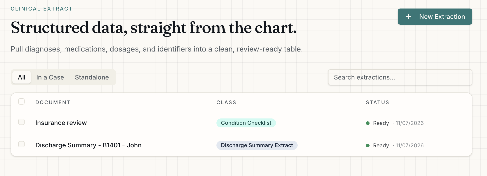
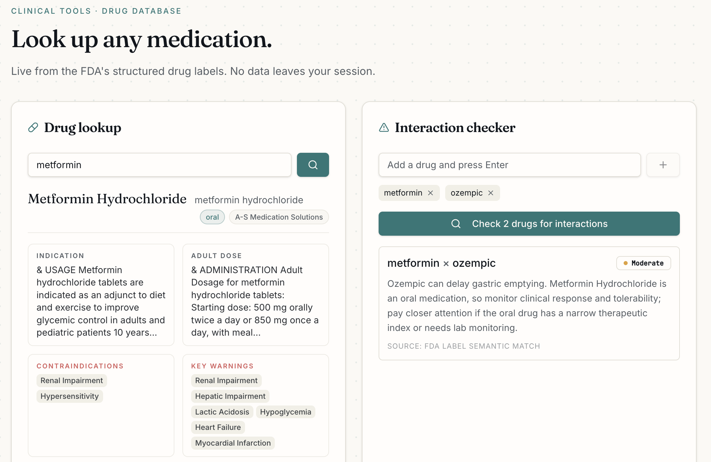
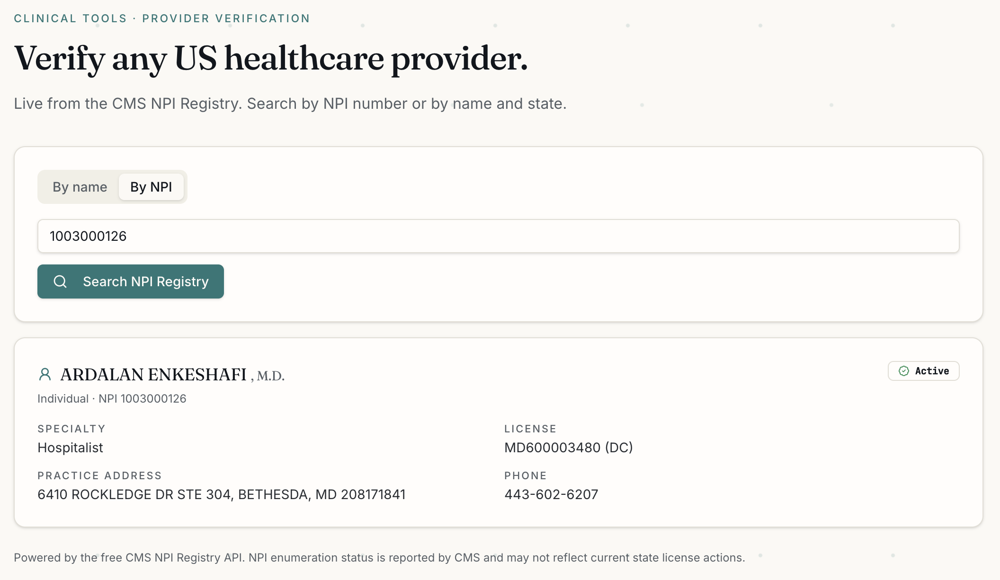

<div align="center">



<div align="center">
  
</div>

### Open-source AI platform for clinical documentation intelligence

**The AI layer for the 49% of physician time that doesn't involve patients.**

[](https://www.gnu.org/licenses/agpl-3.0)
[](https://github.com/gpavan1992/nota-health)
[](https://supabase.com)
[](https://lovable.dev)
[](https://github.com/gpavan1992/nota-health)

[**Live Demo**](https://nota-health-hub-ai.lovable.app/) · [**Report a Bug**](https://github.com/gpavan1992/nota-health/issues)

[Screenshots](#screenshots) · [Quick Start](#quick-start) · [Architecture](#architecture) · [Roadmap](#roadmap)

</div>

---

## The Problem

Ambient AI scribes like Abridge ($1B raised) and Nabla (100,000+ clinicians) 
solve one problem — the 27% of physician time that involves patients.

**Nobody built AI for the other 49%.**

> *"Physicians spend 49% of their time on administrative tasks. Only 27% with patients."*  
> — NEJM Catalyst

> *"Prior authorization denials cost US hospitals $19.7 billion annually."*  
> — AMA 2023

> *"The average discharge summary takes 45 minutes to write. 60% are never read."*  
> — JAMA

The prior authorizations. The discharge summaries. The insurance appeals. 
The referral letters. The medication reconciliations.

This is where Nota Health lives.

---

## What Nota Health Does

<table>
<tr>
<td width="50%">

### 🏥 Clinical Assistant
Chat with any clinical document in plain language. Upload a discharge summary, 
prior auth, lab report, or referral letter and ask questions about it.
AI responses stream in real time using your own API key.

</td>
<td width="50%">

### 📊 Clinical Extract
Pull structured data from clinical documents automatically.
Medications with dosages, diagnoses with ICD-10 codes, lab values with 
reference ranges, follow-up actions — all extracted into clean tables.

</td>
</tr>
<tr>
<td width="50%">

### 📋 Clinical Protocols
Pre-built AI workflows for the most common clinical documentation tasks:
Prior authorization review, discharge summary analysis, referral letter 
drafting, insurance appeal generation, SOAP note formatting.

</td>
<td width="50%">

### 🔬 Clinical Intelligence Tools
Four standalone tools powered by free public APIs — no AI key required:
Drug database and interaction checker, PubMed literature search, 
US provider verification (NPI Registry), ICD-10 code lookup.

</td>
</tr>
</table>

---

## Clinical API Integrations

Nota Health connects to six free public clinical APIs out of the box.
No commercial dependencies. No API keys required for clinical tools.

| Integration | What It Provides | Auth Required |
|---|---|---|
| **OpenFDA** | Drug labels, warnings, adverse events, recalls | No |
| **RxNav (NLM)** | Drug interactions, RxNorm normalization | No |
| **NPI Registry (CMS)** | US provider verification and lookup | No |
| **PubMed (NCBI)** | Clinical literature search and citation verification | Optional |
| **ICD-10 (CMS)** | Diagnosis code lookup for documentation and billing | No |
| **ClinicalTrials.gov** | Trial protocols and eligibility criteria | No |

---

## Why this exists

| Metric | Source |
|---|---|
| **49%** of physician time goes to admin, only 27% with patients | NEJM Catalyst |
| **15.6 hours/week** spent on documentation by clinicians | Annals of Internal Medicine |
| **$19.7B/year** cost of prior auth denials to US hospitals | AMA, 2023 |
| **1 in 5** prior auths initially denied, 75% approved on appeal | KFF |

## Compared to a typical SaaS documentation tool

|  | **Nota Health** | Typical SaaS vendor |
|---|---|---|
| **Where your data lives** | Your own Supabase project, your own infrastructure | Vendor's servers |
| **Source code** | Fully open, AGPL — read every line | Closed |
| **Pricing** | Free to self-host, forever | Per-seat subscription, usually annual |
| **AI provider** | Bring your own key — Claude, GPT, or Gemini | Locked to whatever the vendor chose |
| **Customization** | Fork it, extend it, change anything | Feature requests go into a backlog you don't control |
| **Exit** | Your data, your database — leave anytime | Contract renewal, data export process, migration risk |

Nota Health doesn't compete on having a bigger team or a sales process. It competes on not needing either.

## Is this for you?

**Good fit if you:**
- Run a clinic or hospital and want AI on your documents without a permanent vendor contract
- Have a Supabase project and an Anthropic/OpenAI/Gemini API key
- Want to self-host and control exactly where patient data lives

**Not a fit if you:**
- Need a plug-and-play SaaS with a support team on call — this is open source, you run it
- Need in-visit ambient transcription — Nota Health starts after the encounter, not during it
- Are not comfortable deploying and maintaining a self-hosted app

## Screenshots
<table>
<tr>
<td></td>
<td></td>
</tr>
<tr>
<td><em>Clinical Assistant — chat with any medical document</em></td>
<td><em>Clinical Extract — structured data from clinical documents</em></td>
</tr>
<tr>
<td></td>
<td></td>
</tr>
<tr>
<td><em>Drug Database — real FDA data, interaction checking</em></td>
<td><em>Provider Verification — live NPI Registry lookup</em></td>
</tr>
</table>
---

## Quick Start

### Option 1 — Use the Cloud Version

Go to **[https://nota-health-hub-ai.lovable.app/](https://nota-health-hub-ai.lovable.app/)**

Sign up, add your own AI API key in Settings, and start uploading documents.
No installation required. Your documents never leave your Supabase instance.

### Option 2 — Self-Host

For clinical environments where patient data must stay on your own 
infrastructure.

**Prerequisites:**
- A Supabase project (free at supabase.com)
- At least one AI API key: Anthropic, OpenAI, or Google Gemini

**Steps:**

```bash
# 1. Fork this repository on GitHub

# 2. Create a Supabase project at supabase.com

# 3. Deploy to any platform that supports Vite/React apps
#    (Vercel, Netlify, Railway, Lovable, Cloudflare Pages, or your own server)
#    - Import the forked repo
#    - Connect your Supabase project
#    - Set the environment variables below

#    Set these environment variables:
#    VITE_SUPABASE_URL=your-supabase-url
#    VITE_SUPABASE_ANON_KEY=your-supabase-anon-key
```

**Environment Variables:**

```env
VITE_SUPABASE_URL=https://your-project.supabase.co
VITE_SUPABASE_ANON_KEY=your-anon-key
```

AI API keys are stored per-user in Supabase — not in environment variables.
Each user adds their own key in Settings.

---

## Architecture

```
┌─────────────────────────────────────────────┐
│           Frontend (React + Vite)            │
│                                              │
│  Clinical Assistant │ Cases │ Extract        │
│  Protocols │ Drug DB │ PubMed │ Provider     │
└──────────────────────┬──────────────────────┘
                       │
┌──────────────────────▼──────────────────────┐
│              Supabase                        │
│                                              │
│  Auth │ Postgres │ Storage │ RLS             │
│                                              │
│  Tables: cases, documents, conversations,    │
│  messages, extractions, audit_logs           │
└──────────────────────┬──────────────────────┘
                       │
┌──────────────────────▼──────────────────────┐
│           Clinical APIs (free, public)       │
│                                              │
│  OpenFDA · RxNav · NPI Registry             │
│  PubMed · ICD-10 · ClinicalTrials.gov       │
└─────────────────────────────────────────────┘
                       │
┌──────────────────────▼──────────────────────┐
│        AI Providers (user's own key)         │
│                                              │
│  Anthropic Claude · OpenAI · Google Gemini  │
└─────────────────────────────────────────────┘
```

**Key architecture decisions:**

- **Bring your own AI key** — Nota Health never holds your API keys. 
  Each user adds their own key, stored encrypted in Supabase.
- **Row-level security** — Every Supabase table enforces RLS. 
  No user can access another user's data, even if the application 
  layer is compromised.
- **Self-hostable storage** — Documents are stored in Supabase Storage. 
  Self-hosted deployments keep all patient data on your own infrastructure.
- **No vendor lock-in** — Works with Anthropic, OpenAI, or Gemini. 
  Switch providers in Settings.

---

## Security and Compliance

| Control | Status |
|---|---|
| End-to-end encrypted document storage | ✅ |
| Row-level database security (no cross-user access) | ✅ |
| Encrypted API key storage | ✅ |
| Complete audit log (action + timestamp, no PHI) | ✅ |
| Multi-factor authentication | ✅ |
| Automatic session timeout | ✅ |
| Full data export on request | ✅ |
| Permanent data deletion | ✅ |
| Self-hostable on any infrastructure | ✅ |
| Open source — full code auditability | ✅ |
| Business Associate Agreement (BAA) | ○ Self-hosted enterprise |
| SOC 2 Type II | ○ Roadmap |

**On HIPAA:** Nota Health is not a certified HIPAA-compliant service. 
It is architected with HIPAA principles in mind. For regulated clinical 
environments, deploy self-hosted and execute a BAA with your cloud provider.

---

## Built-in Clinical Protocols

Nota Health ships with 8 pre-built AI protocols for common 
clinical documentation workflows:

**Assistant Protocols (conversational):**
- Prior Authorization Review — identifies denial risks and missing documentation
- Discharge Summary Analysis — extracts key clinical information
- Referral Letter Draft — structures specialist referrals
- Insurance Appeal Letter — generates appeals with clinical justification
- SOAP Note Formatter — structures clinical notes

**Extraction Protocols (structured table output):**
- Medication List — drug name, dose, frequency, route, prescriber
- Diagnosis Summary — diagnoses with ICD-10 codes
- Lab Results — values with reference ranges and abnormal flags

---

## Roadmap

**v1.0 — Current**
- ✅ Clinical document chat (multi-model)
- ✅ Structured clinical extraction (6 protocols)
- ✅ Drug database and interaction checker
- ✅ PubMed literature search and citation verification
- ✅ US provider verification (NPI Registry)
- ✅ ICD-10 code lookup
- ✅ Prior authorization review
- ✅ Insurance appeal generation
- ✅ Audit logging
- ✅ MFA support

**v1.1 — Next**
- [ ] Team workspaces with role-based access
- [ ] FHIR R4 document export
- [ ] Custom extraction schemas
- [ ] Bulk document processing
- [ ] MCP connector support — provider-agnostic tool use for the Clinical Assistant

**v2.0 — Future**
- [ ] EHR webhook integration
- [ ] SOC 2 Type II certification
- [ ] On-premise Docker deployment

---

## Contributing

Nota Health is open source under AGPL-3.0 and welcomes contributions.

**Ways to contribute:**
- Report bugs via [GitHub Issues](https://github.com/gpavan1992/nota-health/issues)
- Suggest clinical workflows that should be built-in protocols
- Add extraction templates for your clinical specialty
- Improve documentation
- Star the repo — it helps more clinicians find Nota Health

**To contribute code:**
1. Fork the repository
2. Create a feature branch
3. Make your changes
4. Open a pull request with a clear description

---

## Stack

| Layer | Technology |
|---|---|
| Frontend | React, TypeScript, Vite |
| UI | Tailwind CSS |
| Database | Supabase (Postgres) |
| Auth | Supabase Auth |
| Storage | Supabase Storage |
| Hosting | Lovable / any static host |
| AI | Anthropic Claude, OpenAI, Google Gemini |
| Clinical APIs | OpenFDA, RxNav, NPI Registry, PubMed, ICD-10 |

---

## License
Nota Health is licensed under **AGPL-3.0**.

This means:
- ✅ Free to use for any purpose
- ✅ Free to self-host for your team or organisation
- ✅ Free to modify and extend
- ✅ Commercial use permitted
- ⚠️ If you distribute a modified version, you must open-source it under AGPL-3.0

---

## Built By

**Pavan Galiveeti** — Lead PM building AI products for enterprise teams.
Built with [Claude Code](https://claude.com/claude-code) as AI pair programmer.
Building in public. All feedback welcome.

- LinkedIn: [linkedin.com/in/pavangaliveeti](https://linkedin.com/in/pavangaliveeti)  
- GitHub: [github.com/gpavan1992](https://github.com/gpavan1992)

---

<div align="center">

*Nota Health is not a medical device.*  
*All AI outputs require review by a qualified healthcare professional.*

**[https://nota-health-hub-ai.lovable.app/](https://nota-health-hub-ai.lovable.app/)**

</div>
